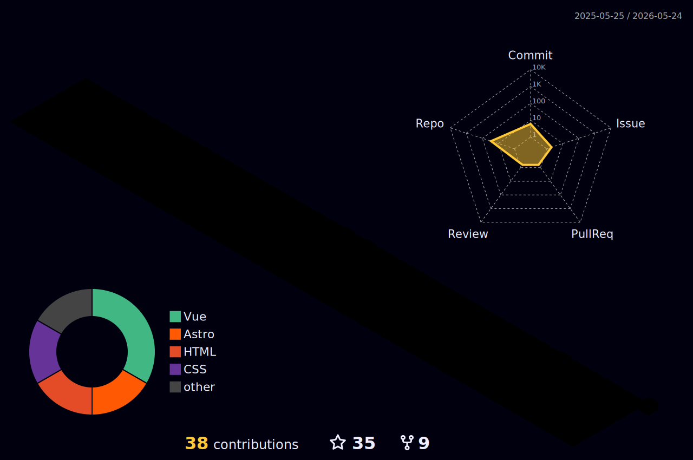

<div align="center">



[](https://git.io/typing-svg)


</div>

## Console

```txt
profile       neko233-com
role          builder / engineer / automation enjoyer
focus         useful tools, playful interfaces, reliable systems
style         animated, data-rich, terminal-bright
status        shipping experiments and polishing details
repo role     GitHub profile README + Cloudflare blog source
```

> GitHub profile rule: this repository is named `neko233-com`, matching the account name, so this README is rendered on the account profile.
>
> Achievement rule: enable private contributions in GitHub profile settings to show the extra achievements unlocked by private contribution activity.
>
> Blog rule: the Cloudflare Pages / Workers static blog source lives in this same repository. See [blog.md](./blog.md) for deployment rules.
>
> Worker rule: Cloudflare Workers deploys through `src/worker.js`, `package.json`, and `wrangler.toml`; the static blog assets are in `site/`.

<div align="center">


</div>

## Dashboard

<div align="center">

<picture>
  <source
    srcset="https://github-readme-stats.vercel.app/api?username=neko233-com&show_icons=true&theme=tokyonight&hide_border=true&rank_icon=github&include_all_commits=true&custom_title=GitHub%20Telemetry"
    media="(prefers-color-scheme: dark)"
  />
  <source
    srcset="https://github-readme-stats.vercel.app/api?username=neko233-com&show_icons=true&theme=default&hide_border=true&rank_icon=github&include_all_commits=true&custom_title=GitHub%20Telemetry"
    media="(prefers-color-scheme: light)"
  />
  
</picture>

<picture>
  <source
    srcset="https://github-readme-streak-stats-eight.vercel.app?user=neko233-com&theme=tokyonight&hide_border=true&date_format=%5BY.%5Dn.j"
    media="(prefers-color-scheme: dark)"
  />
  <source
    srcset="https://github-readme-streak-stats-eight.vercel.app?user=neko233-com&theme=default&hide_border=true&date_format=%5BY.%5Dn.j"
    media="(prefers-color-scheme: light)"
  />
  
</picture>

<picture>
  <source
    srcset="https://github-readme-stats.vercel.app/api/top-langs/?username=neko233-com&layout=compact&theme=tokyonight&hide_border=true&langs_count=10&card_width=780"
    media="(prefers-color-scheme: dark)"
  />
  <source
    srcset="https://github-readme-stats.vercel.app/api/top-langs/?username=neko233-com&layout=compact&theme=default&hide_border=true&langs_count=10&card_width=780"
    media="(prefers-color-scheme: light)"
  />
  
</picture>

</div>

## Signal Board

<div align="center">


</div>

## Tech Stack

<div align="center">


</div>

## Motion Wall

<div align="center">



<picture>
  <source media="(prefers-color-scheme: dark)" srcset="https://raw.githubusercontent.com/neko233-com/neko233-com/output/github-snake-dark.svg" />
  <source media="(prefers-color-scheme: light)" srcset="https://raw.githubusercontent.com/neko233-com/neko233-com/output/github-snake.svg" />
  
</picture>



</div>

## Now

<table>
  <tr>
    <td><b>Building</b></td>
    <td>Small tools, profile visuals, automation pipelines, experiments that feel alive.</td>
  </tr>
  <tr>
    <td><b>Learning</b></td>
    <td>Better product polish, cleaner system design, sharper developer workflows.</td>
  </tr>
  <tr>
    <td><b>Open to</b></td>
    <td>Interesting engineering problems, creative frontends, data-rich dashboards.</td>
  </tr>
</table>

<div align="center">


<sub>Animated profile for <b>neko233-com</b>. Data cards update from public GitHub signals.</sub>

</div>
