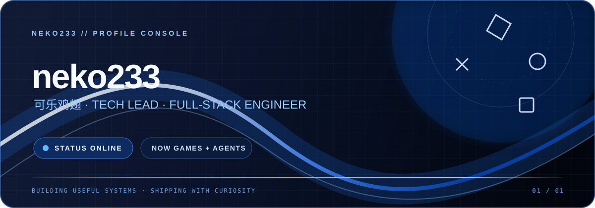

  
  
  

## PLAYER PROFILE · 玩家档案

你好，我是 **neko233**，大家也叫我 **可乐鸡翅**。

我是一名全栈开发工程师和技术负责人，主要在两条线上持续开发：

- **GAME SYSTEMS**：Unity 客户端、热更新、资源与动画表现，以及 Go / Kotlin 游戏后端和分布式服务。
- **AGENT SYSTEMS**：LLM、Tool Calling、MCP、RAG 和自动化工作流，把 Agent 做成能进入真实业务的工具，而不只是一次性 Demo。

喜欢把复杂系统拆成清楚的模块，也喜欢把真正解决过的问题写成代码、文章和可复用工具。

## NOW PLAYING · 当前进行中

<table>
  <tr>
    <td width="50%" valign="top">
      <h3>🎮 GAME DEVELOPMENT</h3>
      
HybridCLR · YooAsset · UniTask · URP · Addressables

      
Cinemachine · Spine 4.3 · Magic Cloth · UGUI / UI Toolkit

    </td>
    <td width="50%" valign="top">
      <h3>🤖 AGENT ENGINEERING</h3>
      
TypeScript · Python · LLM API · Tool Calling · MCP

      
流程编排 · 权限控制 · 测试回归 · 日志监控 · 出错兜底

    </td>
  </tr>
</table>

## LOADOUT · 技术装备

  
  
  
  
  
  
  
  

## SELECTED PROJECTS · 精选项目

| 项目 | 方向 | 我在这里做什么 |
| --- | --- | --- |
| [GitX](https://github.com/neko233-com/GitX) | Rust · React · Git | 面向日常开发的桌面 Git 工作台与终端排查入口 |
| [rdesktop](https://github.com/neko233-com/rdesktop) | Rust · RPC | rdesktop 宿主、同步 / 异步 RPC 与桌面集成能力 |
| [agent-skill-paper-reference](https://github.com/neko233-com/agent-skill-paper-reference) | TypeScript · Agent | 论文检索、引用核对和研究向工作流工具 |
| [SchedulerMeshServer233](https://github.com/neko233-com/SchedulerMeshServer233) | Go · 分布式 | 游戏后端场景中的任务调度与服务协作 |
| [config-migrate-go](https://github.com/neko233-com/config-migrate-go) | Go | 服务版本迭代中的配置迁移工具 |
| [acme-go](https://github.com/neko233-com/acme-go) | Go · ACME | 证书申请和自动化部署工具 |

更多实验项目和日常工具在 [GitHub repositories](https://github.com/neko233-com?tab=repositories)。

## TRANSMISSION LOG · 记录与博客

我的博客是项目日志、踩坑记录和开源笔记的集合：

**[neko233.com → 打开个人博客](https://neko233.com)**

`PROJECT NOTES` · `GAME CLIENT` · `BACKEND` · `AI AGENT` · `OPEN SOURCE`

## ACTIVITY · 活跃轨迹

 

 

> 如果贡献热力图没有显示完整，可能是 GitHub 默认隐藏了私有贡献；可以在个人设置里开启 private contributions 展示。公开统计服务也可能存在缓存延迟。

## SYSTEM LINKS · 入口

[博客](https://neko233.com) · [GitHub](https://github.com/neko233-com) · [项目列表](https://github.com/neko233-com?tab=repositories) · [联系我](mailto:qq1417015340@gmail.com)

 
 

@neko233

